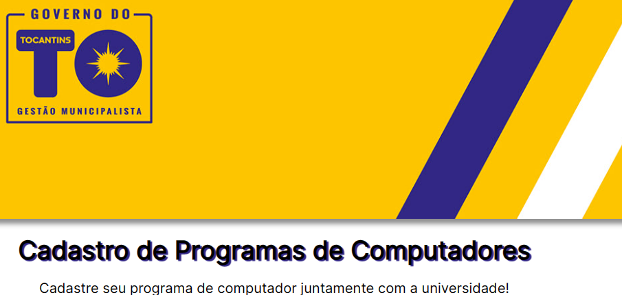

# Projetos Unitins

- ***[Sistema de Cadastros](https://projetos-unitins.vercel.app/)***
- ### **Projeto dedicado a inciação científica do PIBIC, Universidade Estadual do Tocantins juntamente com o Ministério da Ciência e Tecnologia. Um sistema web de cadastro de projetos para programas de computadores...**

---

## Dentro do projeto estão sendo usados:

- [vanilla-extract-css](https://vanilla-extract.style/): Um processador de estilos em CSS com variáveis, usadas em JS e pré-processadas pelo supertipo de TypeScript;

- [vite.js](https://vitejs.dev/): Para o build do projeto React.js do projeto;

- [React-Hook-Form](https://react-hook-form.com/): Biblioteca do próprio React para construção de formulários, desde layout, validação e guarda de dados;
