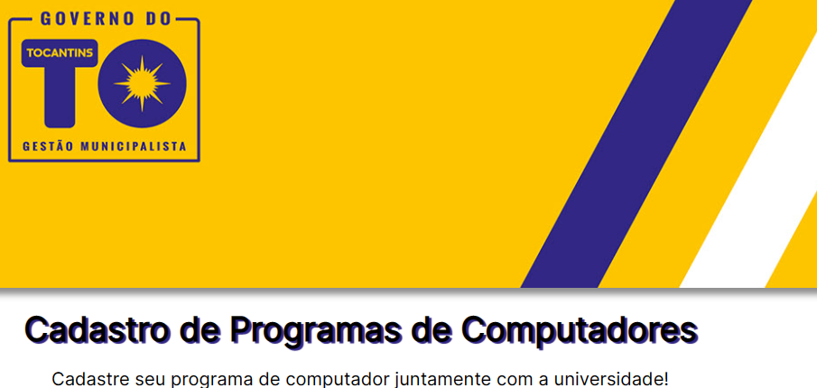

# ***Sistema de Cadastros***

- ### **Projeto dedicado a inciação científica do PIBIC, Universidade Estadual do Tocantins juntamente com o Ministério da Ciência e Tecnologia. Um sistema web de cadastro de projetos para programas de computadores...**

## [Figjam - Fluxograma](https://www.figma.com/file/HqW6H7awPQV2vcWUTlUja0/Fluxograma-Cadastro-Programas-de-Computadores---PIBIC?node-id=0%3A1&t=y9G0qPcIryB9JzH4-1)

---

## Dentro do projeto estão sendo usados

- [TailwindCSS](https://tailwindcss.com/docs/installation): Estilização de CSS e variantes de componentes a partir de classes base de HTML;

- [vite.js](https://vitejs.dev/): Para o build do projeto React.js do projeto;

- [React-Hook-Form](https://react-hook-form.com/): Biblioteca do próprio React para construção de formulários, desde layout, validação e guarda de dados;

---
